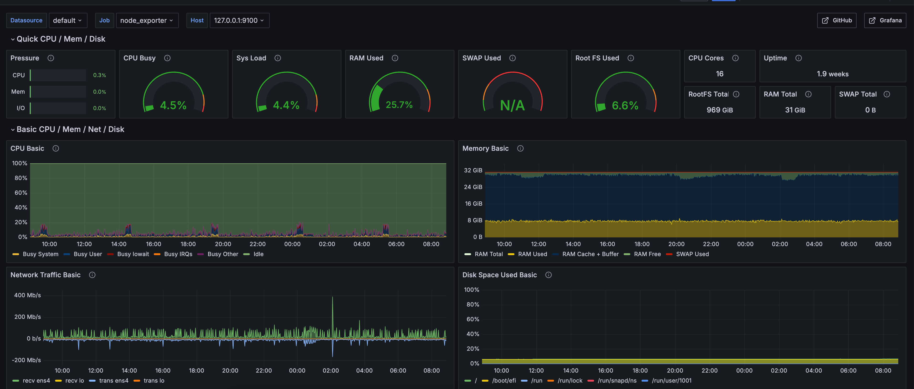
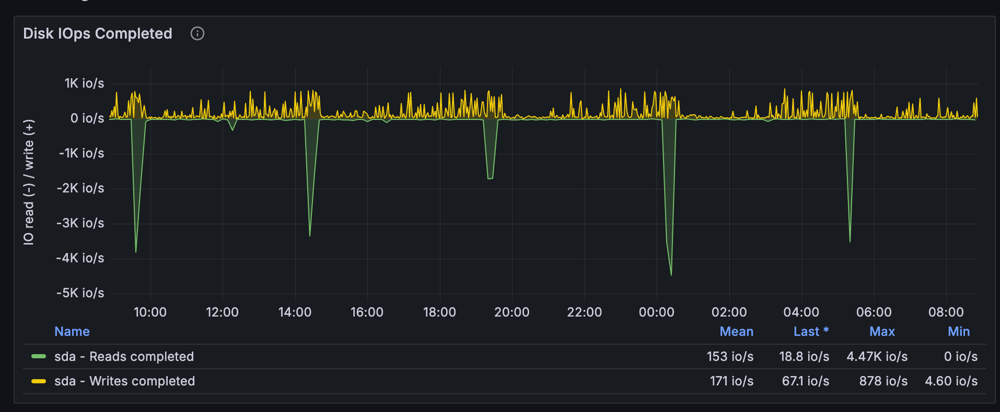
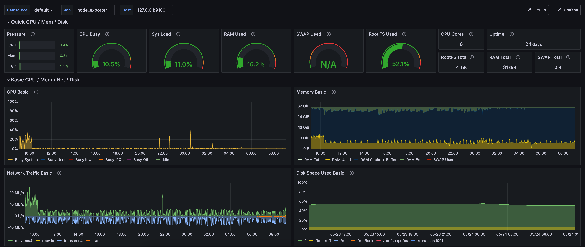
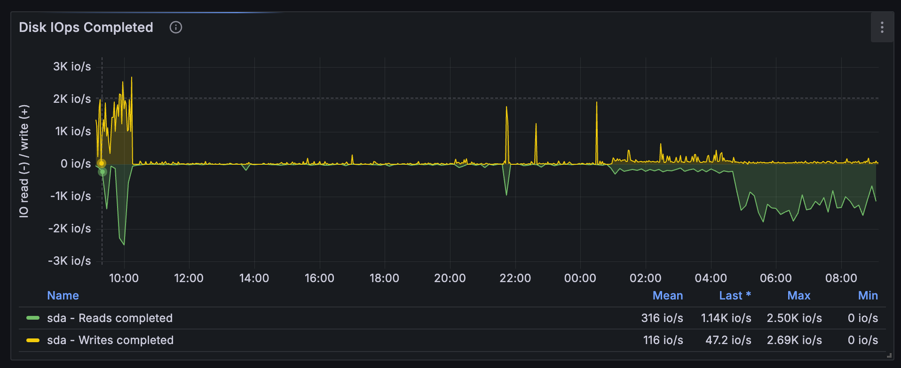

## Hardware

### Validator Mainnet 

- **CPU(s)**: 16 cores AMD EPYC 7B13
- **Local Storage**: 1TB Balanced persistent disk (IOPS ≥ 3000/s)
- **Memory**: 32 GB
- **Network Performance**: 10 to 32 Gbps

### Validator Mainnet - Backup server

- **CPU(s)**: 16 cores AMD EPYC 7B13
- **Local Storage**: 1TB Balanced persistent disk (IOPS ≥ 3000/s)
- **Memory**: 32 GB
- **Network Performance**: 10 to 32 Gbps

----------------------

### Validator Mocha 

- **CPU(s)**: 6 cores / 12 threads (Intel(R) Xeon(R) E-2286G)
- **Local Storage**: 2 x 1TB SSD
- **Memory**: 32 GB
- **Network Performance**: 10 Gbps

----------------------

### Bridge Mainnet 

- **CPU(s)**: 8 vCPU - AMD EPYC 7B13
- **Local Storage**: 4.5TB Balanced persistent disk (IOPS ≥ 3000/s)
- **Memory**: 32 GB
- **Network Performance**: 10 to 32 Gbps

----------------------

### Bridge Mocha 

- **CPU(s)**: 8 vCPU - AMD EPYC 7B13
- **Local Storage**: 5TB Balanced persistent disk (IOPS ≥ 3000/s)
- **Memory**: 32 GB
- **Network Performance**: 10 to 32 Gbps

----------------------

#### The data is based on operating the running nodes, and they are all synced to the chain head.

### Validator Mainnet 

Based on the provided Grafana dashboards and metrics from my node_exporter, I have assessed whether my VPS can handle running a Celestia Validator.

#### CPU, Memory, Network

#### Disk

#### Resource Utilization Summary

**CPU Utilization**
- Current CPU Busy: 4.5%
- System Load: 4.4%
- 24-Hour CPU Usage: Usage remains low.
- **Conclusion**: The CPU usage over 24 hours is minimal.

**Memory Utilization**
- Current RAM Used: 25.7% (of 31 GiB total)
- 24-Hour RAM Usage: Steady usage with significant free memory available.
- **Conclusion**: My system has ample RAM (31 GiB total) with only about 25.7% utilized, indicating sufficient memory for Celestia node operations.

**Disk I/O and Usage**
- Root Filesystem Used: 6.6% of 969 GiB (using RAID 1)
- 24-Hour Disk I/O:
  - Reads Completed Mean: 153 IO/s
  - Writes Completed Mean: 171 IO/s
  - Max Reads and Writes: Peaks up to 4.47K IO/s and 878 IO/s respectively.
- **Conclusion**: The disk utilization is minimal both in terms of capacity (969 GiB total) and I/O operations. The I/O peaks are well within the VPS’s capabilities.

**Network Traffic**
- 24-Hour Network Traffic:
  - Receive Traffic: Peaks below 200 Mb/s
  - Transmit Traffic: Peaks below 200 Mb/s
- **Conclusion**: Network traffic remains within a moderate range, well below typical VPS bandwidth limits (10 to 32Gbps), indicating adequate network resources for the Celestia validator.

**Overall System Health**
- My VPS has sufficient resources (CPU, memory, disk space, and network bandwidth) to handle the additional load of running a Celestia Validator.
- Given the steady and low level of resource utilization, I am confident that my VPS is well-equipped to handle running a Celestia node without compromising performance or stability.

### Bridge Mainnet

Based on the provided Grafana dashboards and metrics from my node_exporter, I have assessed whether my VPS can handle running a Celestia Bridge node.

#### CPU, Memory, Network

#### Disk

#### Resource Utilization Summary

**CPU Utilization**
- Current CPU Busy: 10.5%
- System Load: 11.0%
- 24-Hour CPU Usage: Usage remains low.
- **Conclusion**: The CPU utilization over the past 24 hours has been moderate, with an 8-core system providing ample capacity to accommodate the additional load of running a Celestia bridge node.

**Memory Utilization**
- Current RAM Used: 16.2% (of 31 GiB total)
- 24-Hour RAM Usage: Steady usage well below total capacity, with significant free memory available.
- **Conclusion**: My system has ample RAM (31 GiB total) with only about 16.2% currently utilized. This indicates there is more than sufficient memory available for Celestia bridge node operations.

**Disk I/O and Usage**
- Root Filesystem Used: 52.1% of 4 TiB
- 24-Hour Disk I/O:
  - Reads Completed Mean: 316 IO/s
  - Writes Completed Mean: 116 IO/s
  - Max Reads and Writes: Peaks up to 2.50K IO/s and 2.69K IO/s respectively.
- **Conclusion**: The disk utilization shows moderate usage. Disk space is used at 52.1%, and the I/O operations are within acceptable limits, suggesting enough headroom for additional disk operations from the Celestia node.

**Network Traffic**
- 24-Hour Network Traffic:
  - Receive Traffic: Peaks below 20 Mb/s
  - Transmit Traffic: Peaks below 20 Mb/s
- **Conclusion**: Network traffic remains within a moderate range, well below typical VPS bandwidth limits (10 to 32Gbps).

**Overall System Health**
- System Pressure: CPU, memory, and I/O pressures are low (CPU: 0.4%, Memory: 0.2%, I/O: 5.5%).

**Summary**
- Overall, with sufficiently low resource utilization in CPU, memory, disk space, and network bandwidth, my VPS has the necessary resources to handle the additional load of running a Celestia bridge node.

- The system metrics over the past 24 hours show moderate to low utilization in all key areas, providing assurance for the new workload.

- Given the steady resource utilization, I am confident that my VPS is well-equipped to operate a Celestia node efficiently without compromising performance or stability.
