## Monitoring and Alerting

### Server Monitoring

#### Channels for Server Monitoring

1. **Grafana Monitoring and Notifications**
    - **Description**: Monitor and set notifications for CPU, Memory, and Disk space via Grafana.
    - **Threshold**: Alerts are triggered when usage exceeds 85%.
    - **Notification**: Alerts are sent via Telegram.
    
    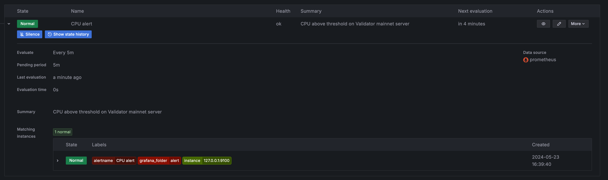

2. **Google Cloud Monitoring and Notifications**
    - **Description**: Monitor and set notifications for CPU, Memory, and Disk space through Google Cloud.
    - **Threshold**: Alerts are triggered when usage exceeds 85%.
    - **Notification**: Alerts are sent via email.
    
    *Setup Alert for CPU*
    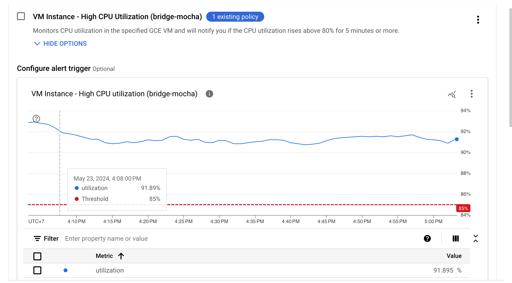
    
    *Alert*
    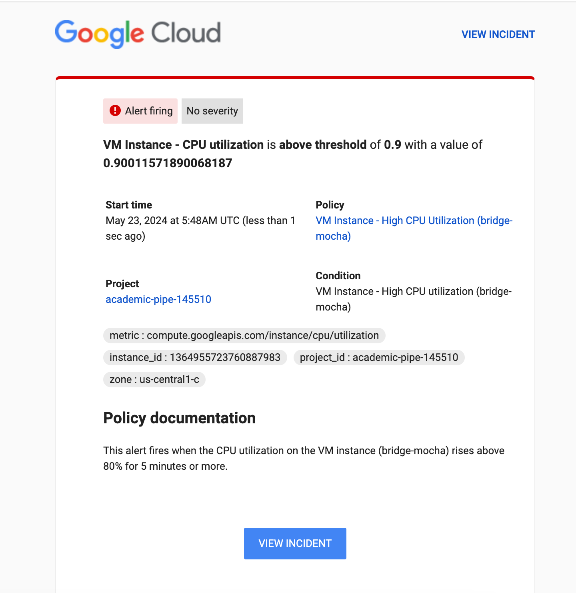

3. **Custom Script Monitoring and Notifications**
    - **Description**: Custom script to monitor CPU, Memory, Disk space, and Network usage.
    - **Threshold**: Alerts are triggered when usage exceeds 85%.
    - **Notification**: Alerts are sent via Telegram.
    
    [Script code](https://github.com/suntzu93/system_monitor/blob/main/system_monitor.sh)
    
    *CPU Usage Alert*
    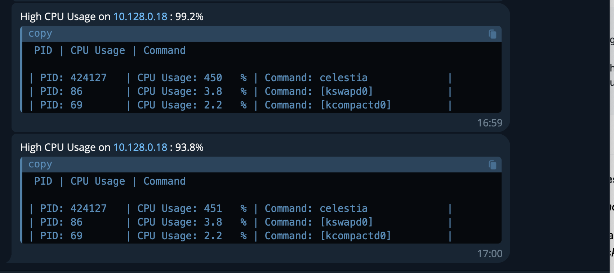
    
    *Memory Usage Alert*
    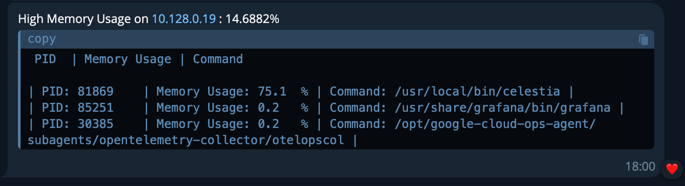
    
    *Disk Usage Alert*
    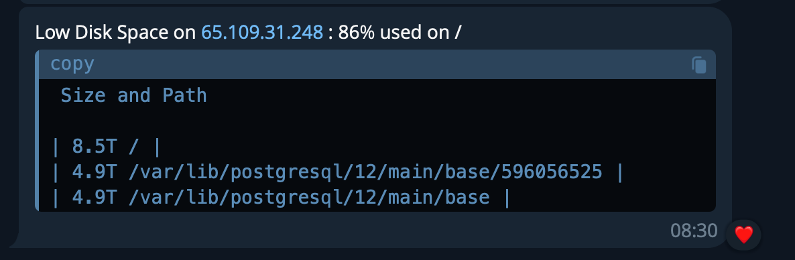
    
    *Network Usage Alert*
    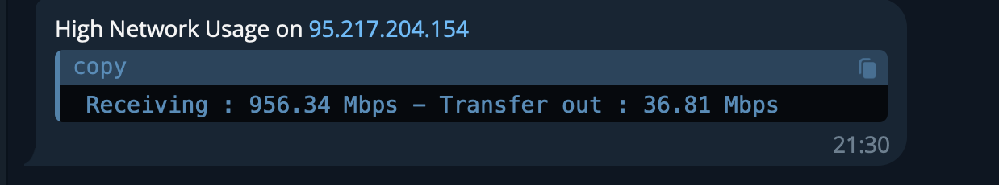

### Node Health Monitoring

#### Channels for Node Health Monitoring

1. **Custom Script for Block Height Monitoring**
    - **Bridge Node**: 
        - **Description**: Monitor `header.height` of the bridge node every minute.
        - **Condition**: If the height doesn't increase within a minute or the endpoint cannot be requested.
        - **Notification**: Alerts are sent via Telegram.
        
        [Code here](https://github.com/suntzu93/system_monitor/blob/main/bridge_monitor.sh)
        
        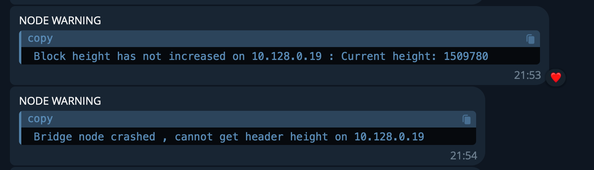
    
    - **Validator Node**:
        - **Description**: Monitor `latest_block_height` of the validator node every minute.
        - **Condition**: If the height doesn't increase within a minute or the endpoint cannot be requested.
        - **Notification**: Alerts are sent via Telegram.
        
        [Code here](https://github.com/suntzu93/system_monitor/blob/main/validator_monitor.sh)
        
        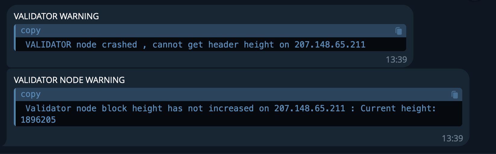

2. **Chainnode Tool and Dashboard**
    - **Description**: Utilize Chainnode's tools for network sync status monitoring and alerting.
    - **Thresholds**:
        1. Validator peers < 10 (`cometbft_p2p_peers`)
        2. Validator online < 90% (must always be 100% to ensure quality, metrics: `cometbft_consensus_validators - cometbft_consensus_missing_validators`)
        3. Validator block missing > 20 (`cometbft_consensus_missing_validators`)
        4. Bridge height > 5 (local bridge height is 5 blocks less than the network bridge height, metrics: `bridge_network_height{} - bridge_local_height{}`)
        
        [Code here](https://github.com/suntzu93/CelestiaTools)
    
        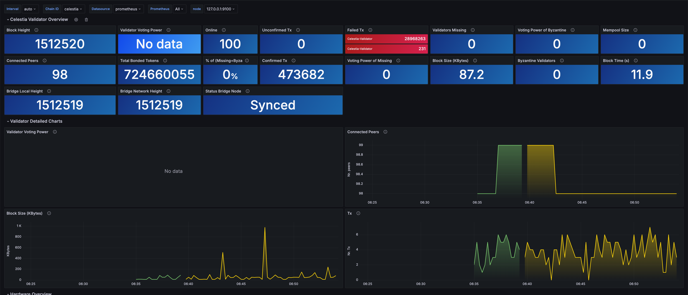
        
        *Alert Setting*
        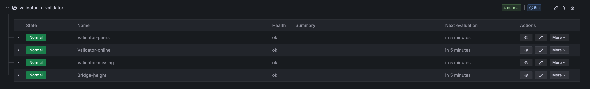

3. **Grafana Loki for Log Collection**
    - **Description**: Collect logs from multiple servers using Grafana Loki.
    - **Functionality**: View and monitor logs of crucial services. Immediate detection of errors through log analysis.
    
    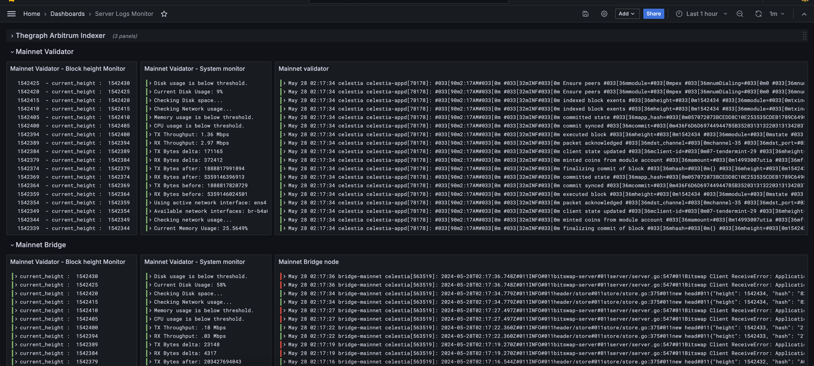
    
    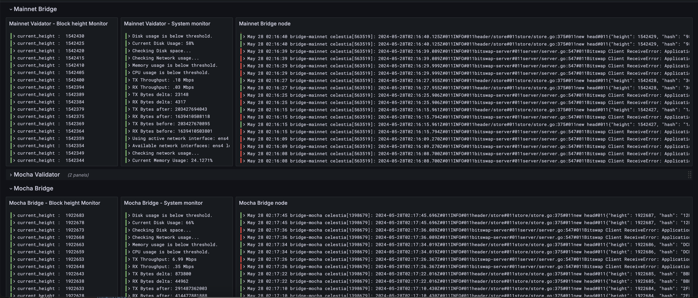
