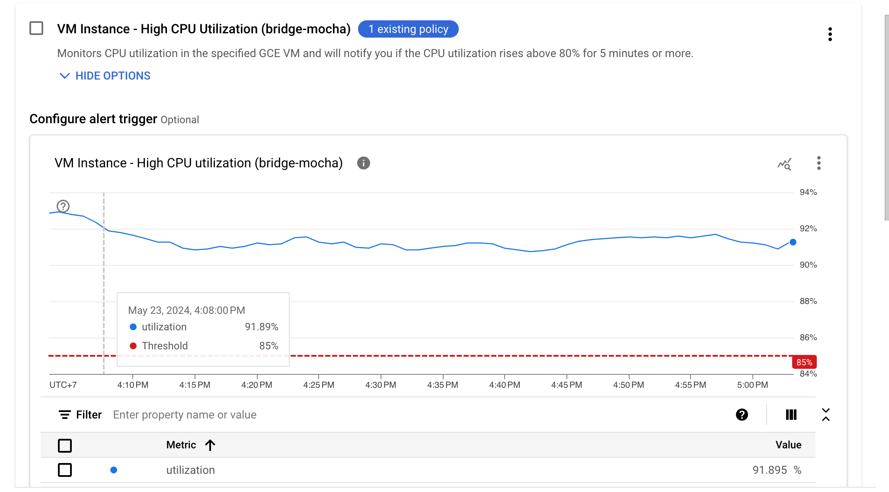
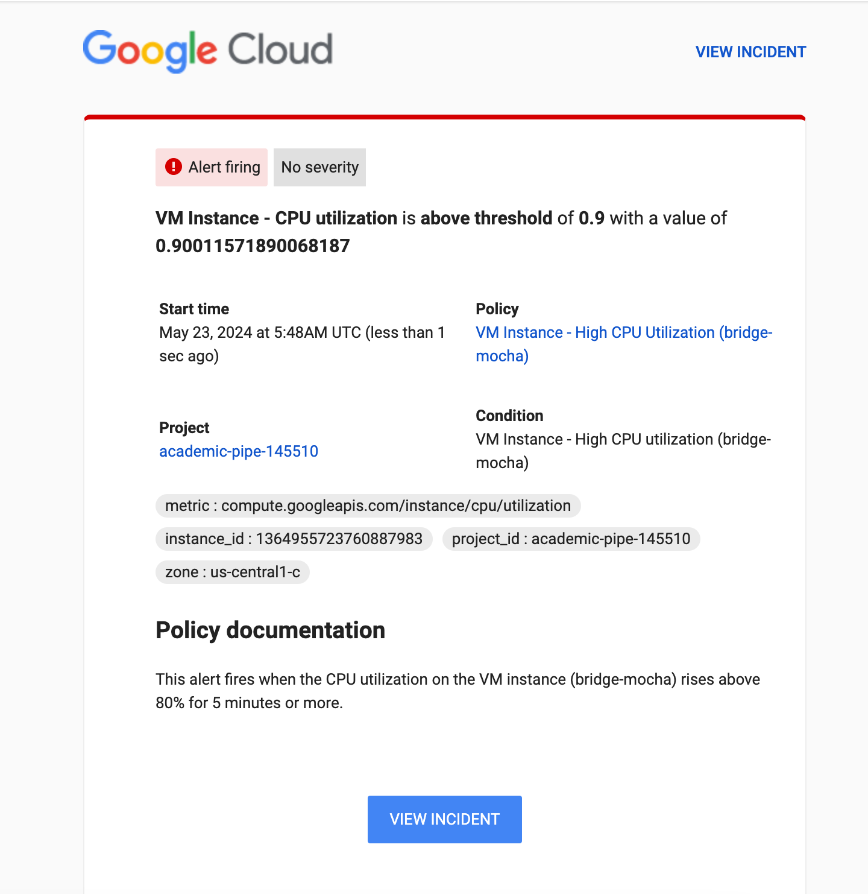
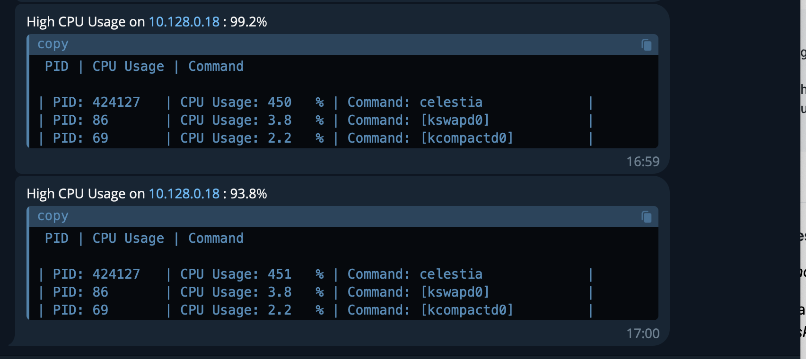
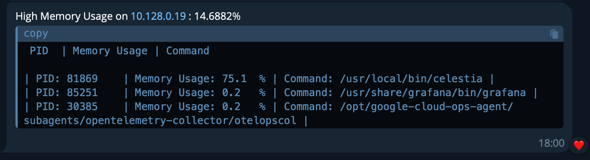
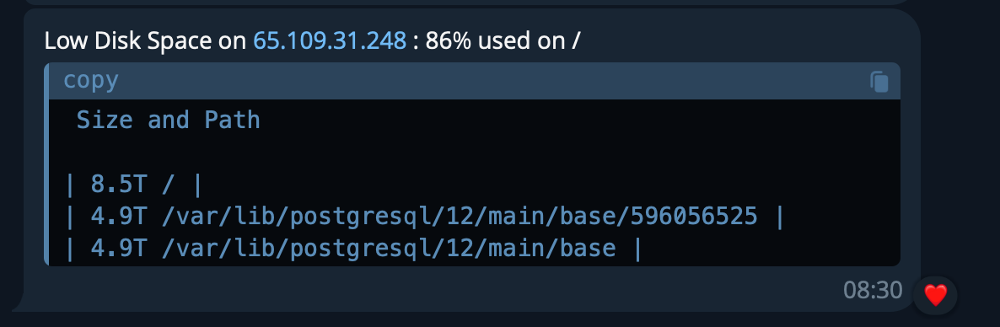

## Hardware

```
Validator mainnet 

CPU(s):                  16 cores AMD EPYC 7B13
Local Storage:           1TB Balanced persistent disk ( IOPS = 3000/s)
Memory :                 32 GB
Network performance	 :   10 to 32 Gbps
----------------------

Validator mocha 

CPU(s):                  6 cores / 12 threads ( Intel(R) Xeon(R) E-2286G )
Local Storage:           2 x 1TB SSD 
Memory :                 32 GB
Network performance	 :   10 Gbps
----------------------

Bridge mainnet 

CPU(s):                  8 vCPU - AMD EPYC 7B13
Local Storage:           1TB Balanced persistent disk ( IOPS = 3000/s)
Memory :                 32 GB
Network performance	 :   10 to 32 Gbps
----------------------

Bridge mocha 

CPU(s):                  8 vCPU - AMD EPYC 7B13
Local Storage:           5TB Balanced persistent disk ( IOPS = 3000/s)
Memory :                 32 GB
Network performance	 :   10 to 32 Gbps
----------------------

```


### Security

**Server**

 *Operating System*

```
1. I always keep the software and libraries frequently updated to the latest version
2. I only install the software I know or research before installing, and only install it when necessary.
3. I always use non-administrative account to protect my server against brute force attacks which are trying to guess my "root" password.
```

*Network Security*

```
1. I enable the firewall on both my server and VPC Google Cloud firewall, only opening ports that I allow access to.
2. I used SSH key authentication instead of passwords , also changed default SSH port from 22 to another port.
3. I disabled login to root via ssh.
4. I will also enable Cloud IDS if chosen by the Celestia team to delegate in Cohort 2. Cloud IDS provides threat detection for intrusions, malware, spyware, and command-and-control attacks on my network.
```

**Private keys**

```
1. On ETH and ERC20 chains, I use separate wallets for daily activities, maintaining a low balance. For holding wallets and validator wallets, I use safe.global and require 2 confirmations from my 2 Ledger wallets for any transaction.
2. On Cosmos and other chains where multisig isn't common, I always use a Ledger if it's supported.
3. Regarding the Ledger seed phrase, I split it into 2 parts, and both parts are AES-256 encrypted. One part is stored on the cloud, and the other part is stored on a USB.I used my code to encrypt/decrypto my seed phrase, I just uploaded here https://github.com/suntzu93/aes_en_de_crypto_key/blob/main/main.py. 
```

**Others**

```
1. Enable Google Authenticator 2FA for all my services and accounts.
2. I am always cautious with emails, always double-checking URLs and emails.
3. I never download any files through email.
4. Passwords used for crypto accounts are different from those used for regular services.
5. Do not use cracked software or software from unknown sources.
6. Do not interact with contracts before verifying, and do not approve more funds than needed.

```

## Monitoring and Alerting

### Server

#### I have 3 channels to monitor the server and notify me of any issues.
*1. I use Grafana to monitor and set notifications for CPU, Memory, and Disk space when they exceed the threshold of 85%. It will notify my Telegram.*


*2. I use Google cloud and set notifications for CPU, Memory, and Disk space when they exceed the threshold of 85%. It will notify my email.*

Setup alert for cpu


Alert



*3. I have coded a bash script to monitor CPU, Memory, Disk space, and Network usage when they exceed the threshold of 85%. It will notify my Telegram.*

Core here : [Code](https://github.com/suntzu93/system_monitor/blob/main/system_monitor.sh)

CPU


Memory 


Disk


Network


### Node health

